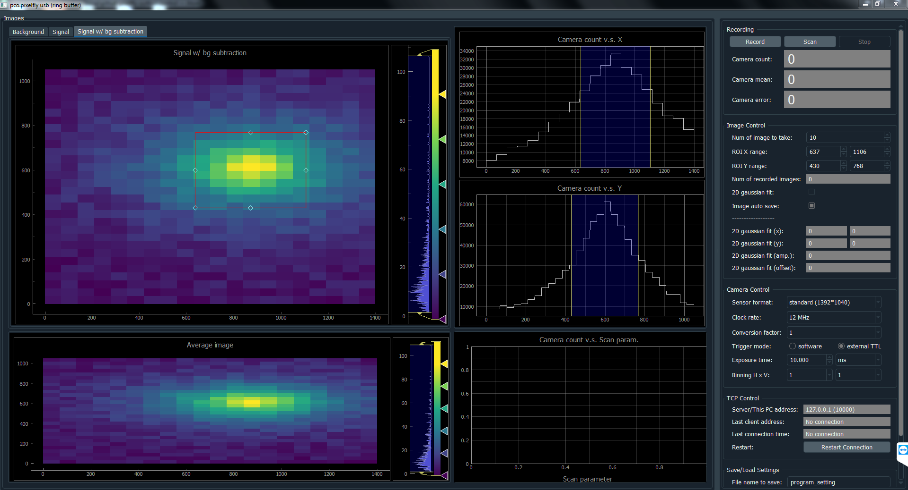

# pixelfly-python-control

This graphical user interface of [pco.pixelfly usb](https://www.pco.de/scientific-cameras/pcopixelfly-usb/) scientific camera is designed for applications in atomic, molecular and optical (AMO) physics experiments.

Key features include:
- camera configuration
- real time image display
- region of interest (ROI) selection
- real time image statistics (including 2D Gaussian fit)
- target system parameter scan (in coordinate with other programs/devices)
- socket network communication (as server)
- save and load program settings

Written in Python 3.8.6. Frequently tested on Window 7. A 24-inch 1080p monitor is recommended for the best graphical display.

## Usage

All images/plots and indicators are updated in real time.

#### Control frame (right-hand side)
Default settings, legitimate choices and some camera specifications are listed in `defaults.ini`.
- Recording
	- This section allows users to start or stop a camera recording task at any time. There are two modes of image acquiring, **Record** and **Scan**. Different plots and indicators are updated in different modes. Current version of the program assumes that background images and signal images are taken in an alternate manner, i.e. a background image is always followed by a signal image, and vise versa. Control widgets are disabled and grayed out during image acquiring, to avoid accidental parameter change.
	- In **Record** mode, the program and the camera take as many images as users specify in the Image Control section, and average over all the acquired images.
	- In **Scan** mode, the program reads the latest scan sequence file (.ini) and take images as this file indicates. This file is supposed to include a scan sequence as well as scan settings. Such file can be generated from other device control programs in our experiment ([Example 1](https://github.com/qw372/SrF-lab-control), [Example 2](https://github.com/qw372/SpinCore-Python-Control)). This mode is used in conjunction with other devices to examine target system's (e.g. atoms or molecules) response to the scan parameter(s).
	- Camera count in ROI in the current background-subtracted image is updated in real time in both modes.
	- Mean value and error of mean (standard deviation/sqrt(number of images)) of camera counts are updated here in numbers in **Record** mode. In **Scan** mode, those are plotted in _Camera Count v.s. Scan param._ plot.

- Image Control
	- Most of them are quite straightforward, just a few things to notice:
	- Here _Num(ber) of images_ refers to the number of signal images, not including background images.
	- ROI settings here are internally connected to all graphical ROI selections in images/plots. They change correspondingly. The limit of ROI is image size.
	- Real time 2D Gaussian fit to ROI is limited by CPU power. It will be automatically disabled if ROI size is beyond limit.
	- In **Record** mode, all images are saved in a single group in a HDF file. In **Scan** mode, only images of the same value of scan parameter are saved in the same group, which is named after the corresponding scan parameter value.

- Camera Control
  - Camera configurations can be set in this section. Only some common settings are implemented now.
  - A sanity check of exposure time setting is included at the backend.
  - Changing sensor format or binning can change image size, as well as the absolute limit of ROI.

- TCP Control
	- Other programs can send data to this program through network. For now the received data is interpreted as scan sequence.

- Save/Load Settigns
	- This section allows users to save the current program setting to a local .ini file or load a previous saved setting.
	- Current setting can be saved after the name in _File name to save_ entry, appended by the date and time of that moment, if the checkbox is checked. A dialog box will be prompted if the name already exists, and it will ask whether to overwrite.
	- The _load settings_ button will open a dialog box by default to allow users to choose a file.

#### Image frame (left-hand side)
- All images/plots support interactive mouse control.
- Background image, signal image and background-subtracted signal image are nested in a tab widget. These images, together with x/y-axis camera count plots, are updated in real time in both **Record** and **Scan** mode.
- Averaged image is only updated in **Record** mode
- _Camera Count v.s. Scan param._ plot is only updated in **Scan** mode. Its error bar shows error of mean. Currently this is a 1D plot, so camera count can only be ploted v.s. one scan parameter.

## Workflow in a nutshell
In both **Record** and **Scan** modes, a separate `Qthread` will be launched when image acquiring starts. This `Qthread` will check if a new image is available in the camera and read it out to computer when it is. After some preliminary data processing and information collection, all data will be transferred back to the main thread as a dictionary by Pyqt's signal-slot mechanism. The main thread will do 2D Gaussian fit, image saving and GUI widgets update.  

## Install camera
Install USB 2.0 driver from the flash drive that ships with the camera, before install other camera softwares.